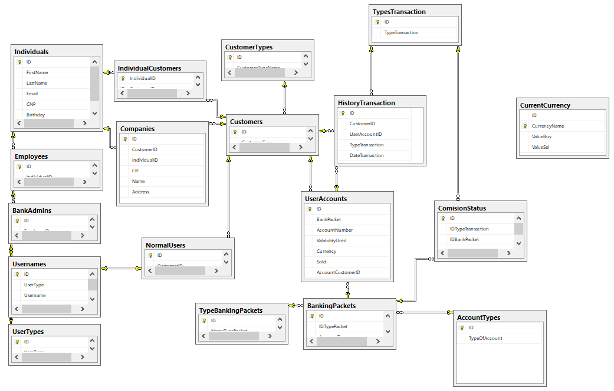

# MitBank
### An internet banking  C# client for a RELATIONAL database
Or just another application keeping trak of your **M**oney **i**n **t**he **Bank**.
### 1. Baza de date

#### Proceduri Stocate
1. AddBankAdmin (IDEmployee, Username, Password)
	* Creeaza un cont-utilizator de Admin (adauga perechea username + password in Usernames, tip admin).
1. AddNormalUser (IDCustomer, Username, Password)
	* Creeaza un cont-utilizator pentru un client al bancii.
1. getAnyoneCurrency (ibanNR) //nume sugerat: IbanToCurrency
	* Face un *SELECT* care intoarce moneda contului cu IBANul primit ca parametru.
1. getIdCustomer (userID, idClient OUTPUT)
	* Seteaza variabila de output cu IDul clientului ce are username-ul primit ca parametru.
	* -1 in caz de eroare.
1. getUandPProcedure(Username, Password)
	* Face un *SELECT* care intoarce ID ul inregistrarii corespunzatoare din tabela Usernames 
1. isAdmin (UserID, Result OUTPUT)
	* Pune 1 sau 0 in variabila Result.
1. putMoneyOnAccount (IBAN, idAdmin, valueMoney)
	* Adminul pune suma de bani a clientului in contul cu IBANul.
1. selectOnIndividuals (id)
	* Face *SELECT* dupa persoana fizica caruia ii este atribuit username-ul cu id-ul parametru.
1. showAllMyAccounts (idUsername)
	* Face *SELECT* dupa IBANurile clientului cu idUsername.
1. showIBANInformations (iban)
	* Face *SELECT* total pe UserAccounts, dupa contul cu IBANul primit ca parametru.
1. takeComision (tiptranzaction, accountNR)
	* Face *SELECT* dupa Comisionul pus tranzactiei *tiptranzaction* pentru pachetul caruia ii este alocat contul cu IBANul *accountNR*.
1. transferMoney (fromIBAN, toIBAN, valueToTransfer, valueToReceive)
	* Face ce trebuie.
	
#### View-uri:
1. ComisionOffert
### 2. Aplicatia (Clientul)
Aplicatia este gandita pe 2 layere, astfel:
1. Layerul **User Interface**, cu clasele:
    * Form1
    * Form2
1. Layerul **Data Management**, cu clasele:
    * DataManagement (statica)
##### Principiu de functionare:
Clasa *DataManagement* contine metode statice ce vor fi apelate din clasele de nivel
User Interface. Aceste metode statice se vor conecta la SQL Server, vor executa
operatiunile prevazute si vor intoarce spre User Interface un obiect de tip *Page*,
ce urmeaza a fi afisat utilizatorului prin grija interfetei grafice.
### 3. Tehnologia ADO.NET utilizata: Entitiy Framewok
De invatat!
###### Referinte:
[Ghid github](http://rogerdudler.github.io/git-guide/)
